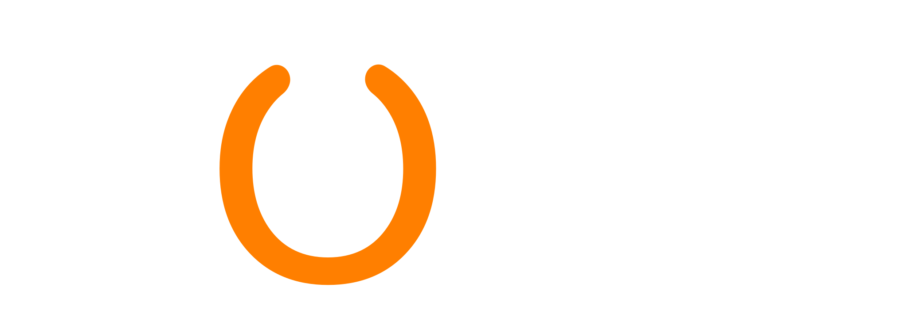

<!-- _footer: EL AINE El Mehdi - THOMAS Robin - BONAL Alexis -->

# Cahier des charges

Tennis de table pour tous

---

<!-- paginate: true -->

## L'association

**Piong** est une association de tennis de table ouverte à tous.

Localisée dans la métropole lilloise, elle organise différents évènements tels que des tournois ou d'autres moments de convivialité.

---

## Référencement

Nom de domaine : **[www.piong.fr](www.piong.fr)**

Mots clés : _piong, tennis de table, Lille, pongiste, tournois, championnat_

---

## Charte graphique

Couleur principale : **Orange** (#ff7f00)
Couleur de fond : **Gris Foncé** (#202228)

---

## Page - Accueil

- la prochaine **compétition**
- les **4** derniers articles
- le prochain **rassemblement convivial**

---

## Page - Articles

Au premier affichage, les dix premiers **articles**.

Un bouton ou un scroll down permettrait de charger les articles plus anciens.

---

## Page - Évènements

Une page regroupant les **évènements** auxquels les membres peuvent participer.

Deux sous pages pour regrouper :

- les compétitions
- les rassemblements

---

## Page - Contact

Une page de contact très simple pour
**contacter l'association**

---

## Page - Connexion

Page regroupant **inscription** et **connexion**

---

## Page - Administration

Panel offrant une gestion sur :

- les **articles**
- les **évènements**
- les **utilisateurs**

---

## Fonctionnalité - Articles

|                   | Publique | Membres | Administrateur |
| ----------------- | -------- | ------- | -------------- |
| Voir              | **X**    | **X**   | **X**          |
| Réagir, commenter |          | **X**   | **X**          |
| Rédiger           |          |         | **X**          |

---

## Fonctionnalité - Évènements

|            | Publique | Membres | Administrateur |
| ---------- | -------- | ------- | -------------- |
| Voir       | **X**    | **X**   | **X**          |
| Participer |          | **X**   | **X**          |
| Ajouter    |          |         | **X**          |

---

## Fonctionnalité - Authentification

|                         | Publique | Membres | Administrateur |
| ----------------------- | -------- | ------- | -------------- |
| Inscrire                | **X**    |         |                |
| Connecter               |          | **X**   | **X**          |
| Valider une inscription |          |         | **X**          |

---

## Entité - Article

| **Article**            |
| ---------------------- |
| Titre                  |
| Image mise en avant    |
| Catégorie (Facultatif) |
| Auteur                 |
| Contenu (MD)           |

---

## Entité - Évènement

| **Évènement**               |
| --------------------------- |
| Titre                       |
| Flyer mise en avant         |
| Compétition / Rassemblement |
| Contenu (MD)                |

---

## Entité - Utilisateur

| **Utilisateur**      |
| -------------------- |
| email (login)        |
| Mot de passe (hashé) |
| Rôle                 |
| Nom                  |
| Prénom               |
| Tél                  |

---

## Entité - Compétiteur

| **Compétiteur**  |
| ---------------- |
| _...Utilisateur_ |
| Num. License     |

---

## Organisation

Les membres du groupe sont tous développeurs et développeront leurs fonctionnalités.

Chacun devra s'assurer du respect de certains points :

- **El Mehdi** : Responsable ??
- **Robin** : Responsable ??
- **Alexis** : Responsable ??

---

## Outils

- **Discord**
- **Github**

---

## Pile technique

Nous utiliserons **TypeScript** pour le projet

| **Backend**        | **Frontend** |
| ------------------ | ------------ |
| Node               | Vite         |
| Express            | React        |
| MongoDB + Mongoose |              |
