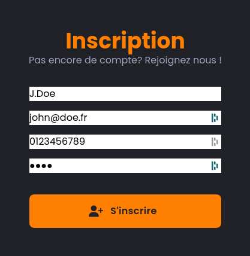
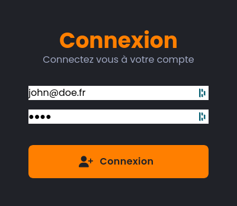

# Documentation Utilisateur

Cette documentation est faite pour les utilisateurs du site.

## Publique

### Inscription

path : `/login`

### Connexion

path : `/login`

### Consulter les pages du site

path : `/*`

### Articles

### Événements

### Contact

## Membre

### Réactions

### Commentaires

### Participation à un événement

## Licencié

### Participation à un tournoi

### Consultation des scores

## Administrateur

### Ajouter un article

### Créer un évènement

### Validation des nouveaux utilisateurs

### Supprimer un utilisateur
