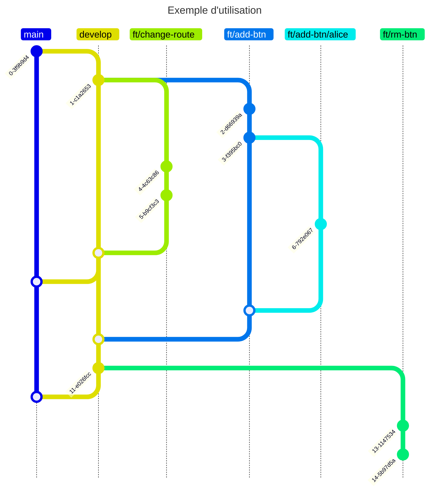

# piong

## Prérequis

### pnpm

Vous pouvez installer globalement pnpm via la commande npm suivante :

```sh
npm install -g pnpm
```

Voir aussi : <https://pnpm.io/fr/installation>

## Commandes

Les commandes doivent être exécutées à la racine du projet.

### Install

Installer les dépendances de tous les projets :

```sh
pnpm install
```

### Build

Compilation des projets :

```sh
pnpm build
```

### Start

Exécution des projets :

```sh
pnpm start
```

### Développement

Exécution des projets en mode développement, sur écoute :

```sh
pnpm dev
```

## Commitlint

### Format

Afin d'être validés, les messages de commit devront se faire au format suivant :

`<type>[optional scope]: <description>`

Avec pour attributs :

- `<type>` : un des verbes prédéfinis (build, ci, chore, docs, feat, fix, perf, refactor, revert, style, test).
- `[optional scope]` : la partie du projet concernée par le commit, par exemple, `front` ou `back`. Il n'est pas nécessaire pour tous les commits, notamment pour les modifications de configurations ou les modifications impliquant les deux parties.
- `<description>` : brève description du commit sans majuscule initiale (par exemple : "ajout du bouton d'inscription").

### Verbes

Voici les différents verbes utilisables pour les messages de commit

- **build** : Modifications affectant le système de construction ou les dépendances externes (par exemple des modifications de portée telles que gulp, broccoli, npm)
- **ci** : Modifications apportées aux fichiers et scripts de configuration du CI (par exemple Travis, Circle, BrowserStack, SauceLabs)
- **chore** : Modifications qui ne modifient pas le code source ou les tests, par ex. des modifications du processus de construction, des outils et bibliothèques auxiliaires
- **docs** : Seulement des changements dans la documentation
- **feat** : Une nouvelle fonctionnalité
- **fix** : Un correctif de bug
- **perf** : Un changement de code qui améliore les performances
- **refactor** : Un changement de code qui ne corrige pas un bogue ni n'ajoute une fonctionnalité
- **revert** : Annuler quelque chose
- **style** : Modifications qui ne modifient pas la signification du code (espaces blancs, formatage, points-virgules manquants, etc.)
- **test** : Ajout de tests manquants ou correction d'existant

## Utilisation de GIT

### Les différentes branches

La branche `main` est la branche sur laquelle le projet doit toujours être fonctionnel.

La branche `develop` est la branche de développement sur laquelle nous vérifions que tout fonctionne bien avant de merge vers `main`. Ce doit être la seule branche à envoyer de nouvelles modifications sur `main`.

Les branches de fonctionnalités suivent le schéma suivant : `ft/<feature>`.

Les branches personnelles sont tirées d'une fonctionnalité et propres à un développeur. Elles suivent le schéma suivant : `ft/<feature>/<user>`. Elles permettent de faire des tests sur une fonctionnalité spécifique sans en impacter le développement.


TODO List :

Gestion des commentaires 